<h1>Roadmap to develop a Tron Blockchain Application.🔥</h1>

It's been a long time that I've not contributed to new repository or any articles. So, I thought of making a new cheatsheet for the dapp developers out there who want to build a tron network application. Let's make blockchain a better and easy place. 😇
<hr/>

### Table of Contents 📑

<h3>Backend Part 💻</h3>

- [Writing a Smart Contract](#writing-smart-contract)
- [Deploying a Smart Contract](#deploying-smart-contract)
- [Verifying a Smart Contract](#verifying-smart-contract)

<h3>Frontend Part 💪</h3>

- [My General Project Folder Structure](#project-folder)
- [Setting Utility](#utility-setting)

<hr/>

## Backend Part 💻

<h3 id="writing-smart-contract">1. Writing a Smart Contract</h3>

Open up the project folder in your favorite code editor where you wanna store your code. Smart contracts are written in a language called `Solidity`, same language i.e. used in Ethereum Blockchain.

<b>Note: You can use <a href="https://remix.ethereum.org/">Remix Code Editor</a> of Ethereum to develop a contract since they both are kinda lot similar. Or you can use the <a href="http://www.tronide.io/">Tron IDE.</a></b>

`I'd suggest you to use the Remix IDE personally, since it has supported plugins with high responsiveness.`

<h3 id="deploying-smart-contract">2. Deploying Contract to Tron Chain</h3>

a. Visit <a href="https://tronscan.org/">TRON Explorer.</a>

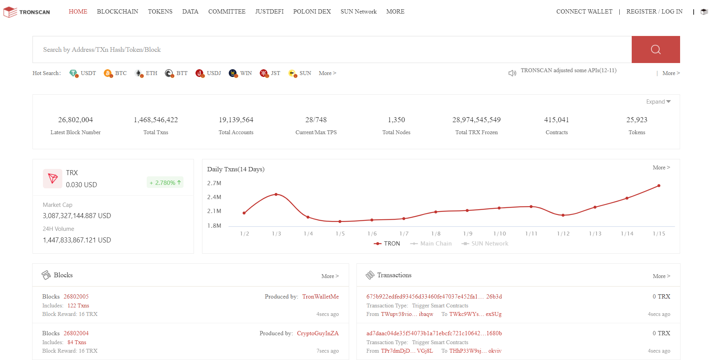
<hr/>

b. Hover Over Blockchain in Top Left Navbar.

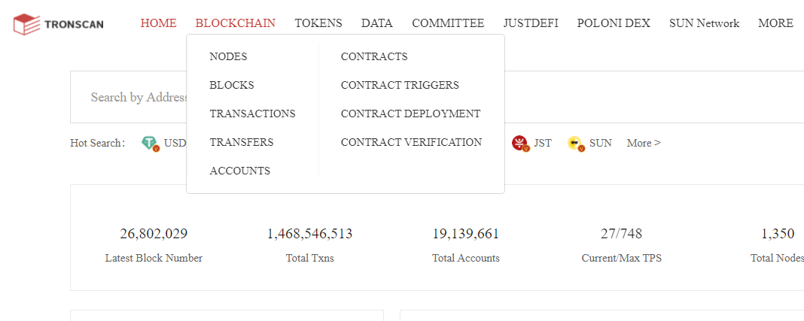

Navigate to Contract Deployment where you'll be able to Deploy your contract <b>Graphically</b>. This method is way a lot easier than deploying the same contract in Ethereum Chain. 😇

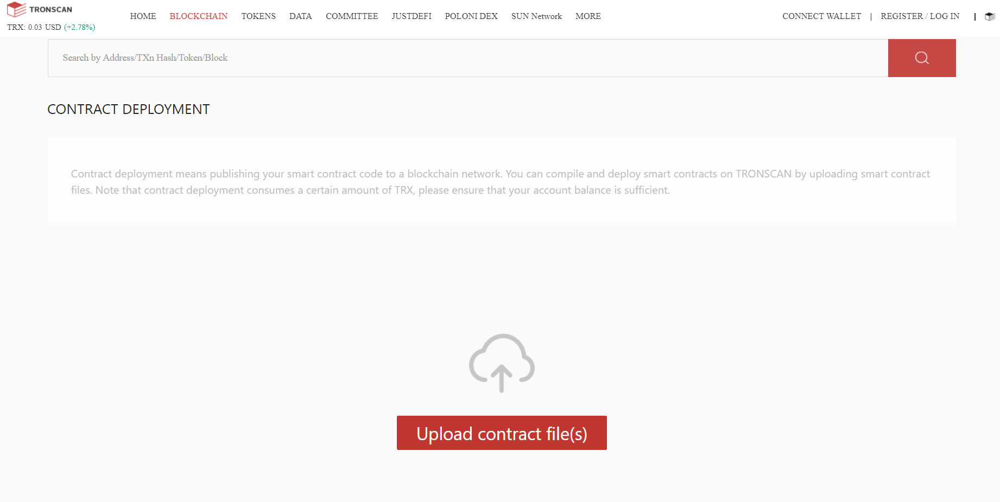
<hr/>

c. Here, if you try to upload the document, it won't work because you need to use the <b>wallet of Tron</b>.

Download the TRONLINK from <a href="https://chrome.google.com/webstore/detail/tronlink%EF%BC%88%E6%B3%A2%E5%AE%9D%E9%92%B1%E5%8C%85%EF%BC%89/ibnejdfjmmkpcnlpebklmnkoeoihofec">here.</a>

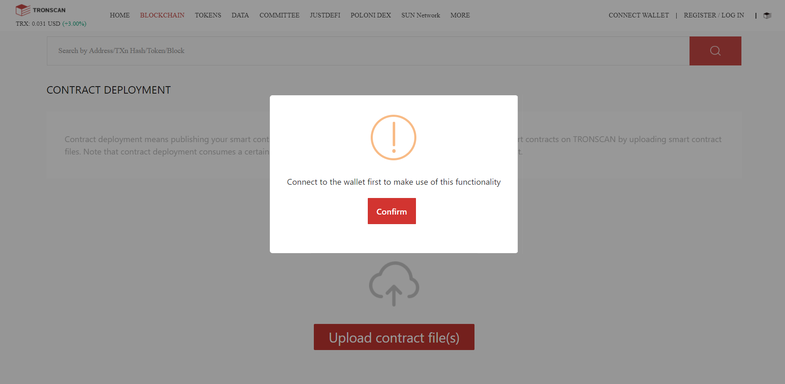
<hr/>

d. Now make sure your wallet is open and ready to ROCK 🤘.

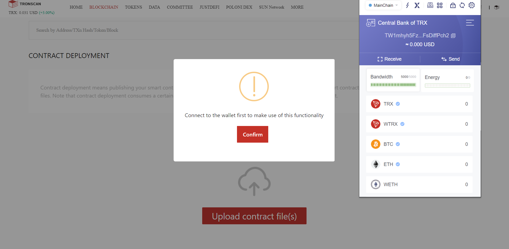
<hr/>

e. Now navigate to Connect Wallet in Top Right of the Navbar

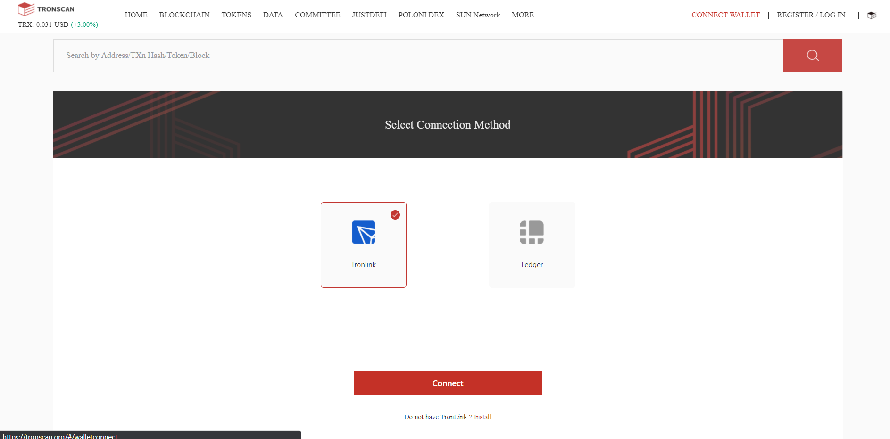

There are 2 options one of them is TRONLINK which you recently installed on your browser extension, other is the hardware wallet named LEDGER but for the convenience you can TRONLINK. 😇

As you saw on my wallet, there is none TRX left to use since I always use them to TRADE LOL. So, Let's use Test Network where you can call for the TRX(TRONIX Coin) from faucet for free development.

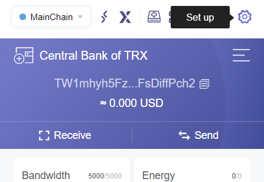

Navigate to Set up and choose Node, where you can see there are lot's of testnet and you can add your own net but I prefer using the shasta testnet since it is more responsive.

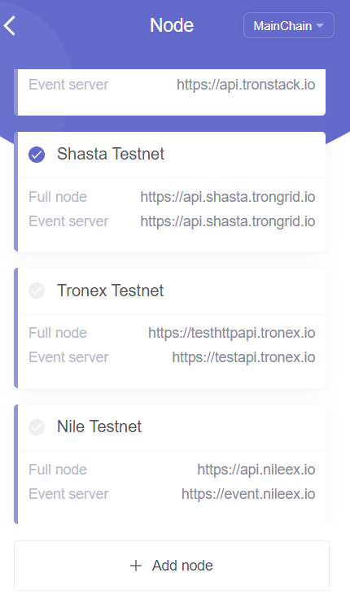

Now, Let's call for the TRX from <a href="https://www.trongrid.io/faucet">Shasta faucet</a>. Copy the public address of wallet and request, after few seconds the fund will be trnasfered to your wallet.

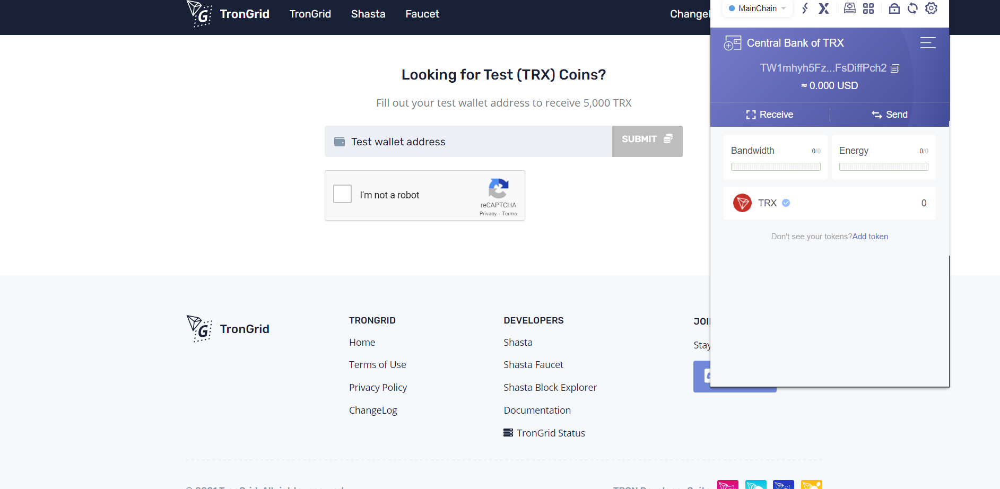

Here, I've got 5000 TRX🔥

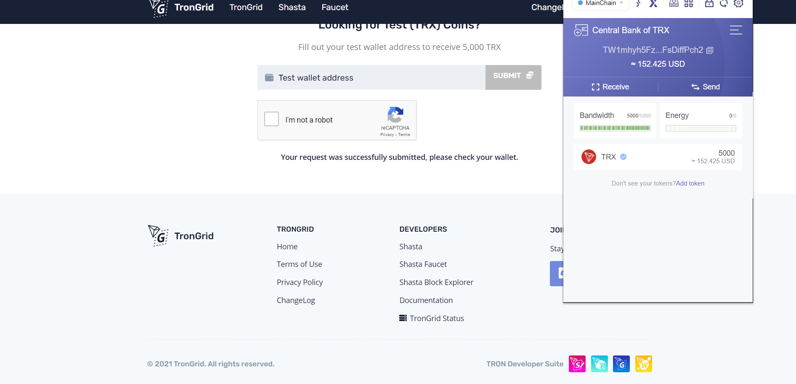

Let's Deploy now. 🚀, Again try to upload all the supportive documents since tronscan allows to upload multiple documents at a time.

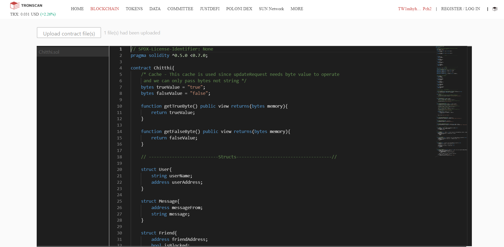

Once the contract, is uploaded naviagate to your main contract in my case it's only one. Now compile your code by choosing the appropriate version of your smart contract.
Note: Remeber which compiler you're using because it'll be used while verifying the contract later.

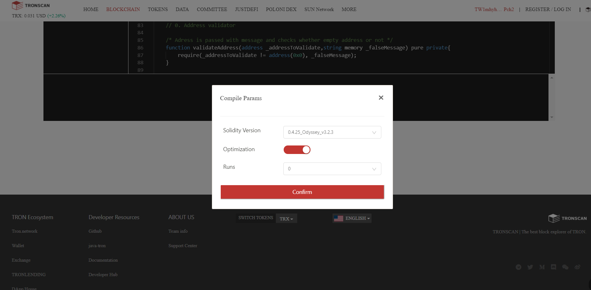

Once you choose the correct version of pragma and compile it, the terminal screen looks like.

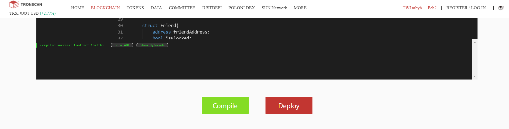

Now, hit deploy for the deployment. Here you should choose the main contract in contract name.

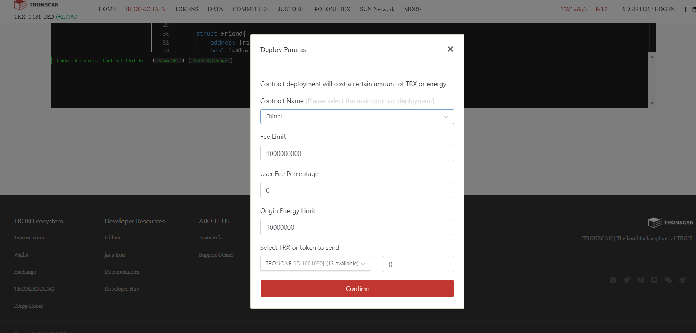

Approve the signature to deploy.

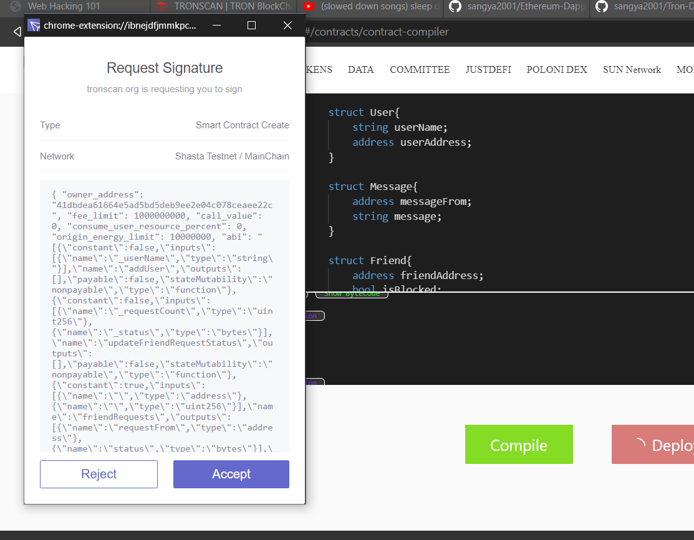

On successful deployment you'll get a transaction hash and a contract address on a output terminal.

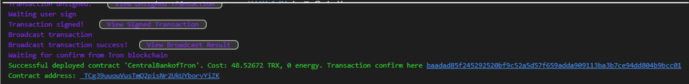

## Horray, We deployed the contract on tron chain successfully! 🎉
<hr/>

<h3 id="verifying-smart-contract">3. Verifying Smart Contract</h3>

a. Just like before hover to the top left of Navigation Bar you'll get a navigator to Contract Verification.


Now fill the contract address, name, the compiler version you've used while deploying the contract. And if you have used the run optimization then you need to choose it.
Also, you need to upload all the documents i.e. contracts you've used while deploying contract.

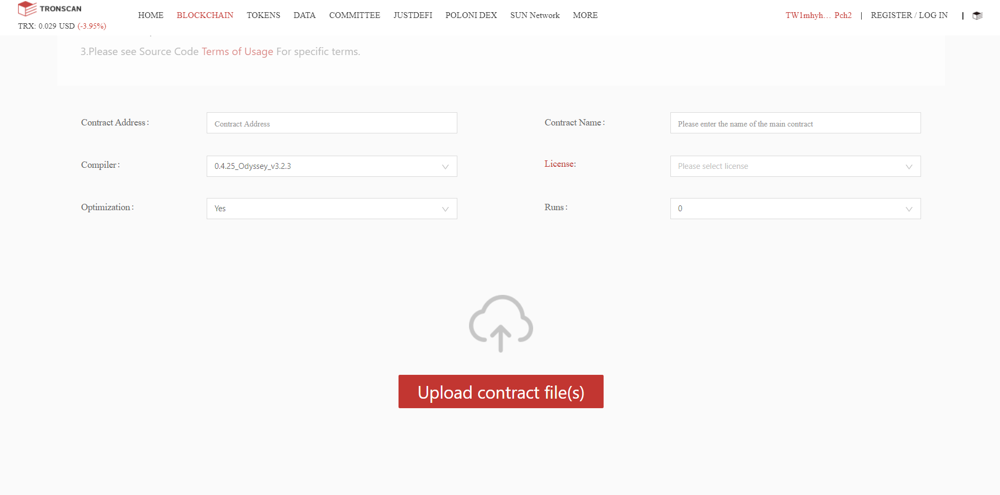
<hr/>

b. A successfull verfication looks like

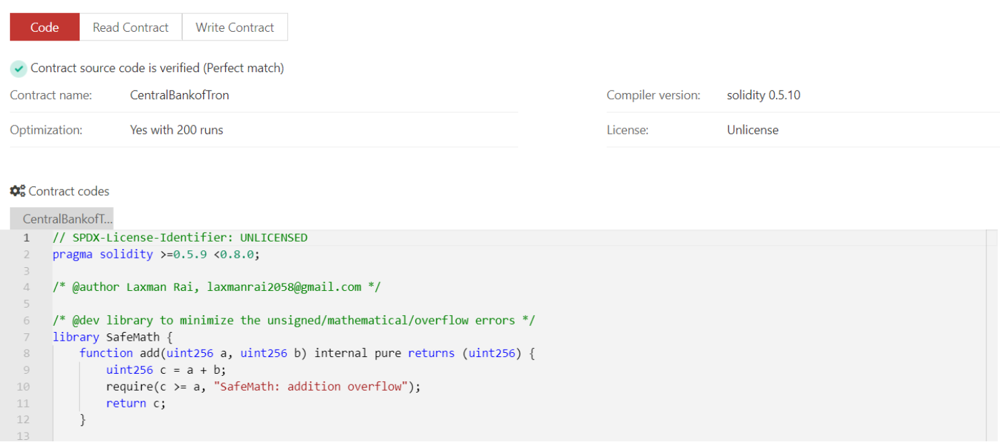

<hr/>

## Frontend Part 💪

<h3 id="project-folder">1. My general project folders structure</h3>

I almost forgot to tell you that, I use React.js in the frontend part and for state management I prefer Context API though people likes Redux. Let's dig in.😇
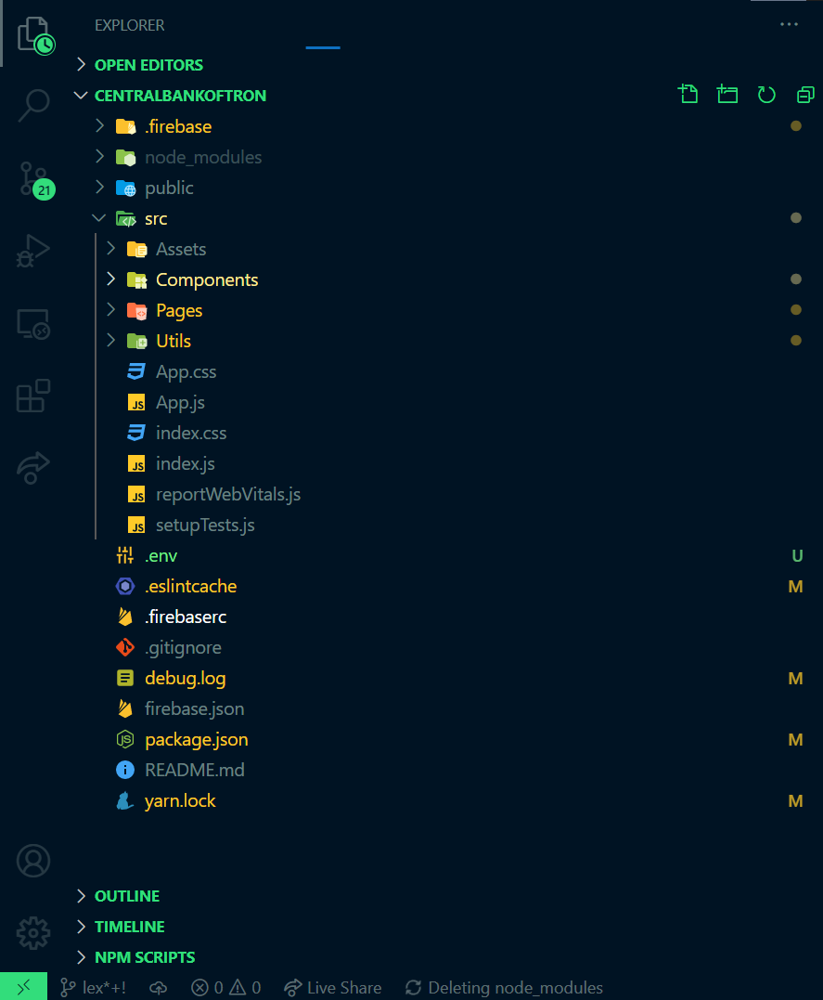

<hr/>

<h3 id="utility-setting">2. Setting a Utility part 🔑</h3>

For ease, I make a folder named utils where I've got `Utils.js`. 

`Note: Well, ethereum dapps had to go through the api but tron makes accesible with only contract address so treat it as a api and set in env file.`

```
// function to check if the tron wallet is logged in or not
const waitTron = () => {
    return new Promise((resolve, reject) => {
        let attempts = 0, maxAttempts = 1000;
        const checkTron = () => {
            if (window.tronWeb) {
                resolve(true);
                return;
            }
            attempts++;
            if (attempts >= maxAttempts) {
                reject(false);
                return;
            }
            setTimeout(checkTron, 100);
        }
        checkTron();
    })
}

// functon to initialize the contract accessor

export const initContract = async () => {
    let tronExists = await waitTron();
    if (!tronExists) {
        alert('Please login into Tronlink wallet extension!');
        return null;
    }
    
    const contractAddress = `${process.env.REACT_APP_CONTRACT_ADDRESS}`;
    let contract = await window.tronWeb.contract().at(contractAddress);
    return contract;
}

```

All this code snippet should not be memorized, LOL. I also copied from the developer guide provided by tron. Click <a href="https://developers.tron.network/docs">here</a> to visit <a href="https://developers.tron.network/docs">tron developer guide</a>.

In fact, it seems bit out of range at a first time but believe me if you get used to it, it's fucking really handy. 🤘

Now, you've done first part of integrating the chain and frontend.

<hr/>

<h3 id="intialize-contract">3. Initializing Method Accessor 🚧</h3>

Navigate to any react page where you want to initialize the method accessor. `Make sure you've got tronlink wallet extension or tronlink pro app.`

```
import { initContract } from "../../Utils/Utils";

export default function Dashboard() {
  const [contract, setContract] = useState(null);
  const [address, setAddress] = useState('');

    useEffect(() => {
        // initilize the contract
        initContract().then((contract) => {
        window.tronWeb.trx.getAccount().then((data) =>
            {
                // here you get the address of the wallet as you would get from web3 in ethereum.
                setAddress(data);
                // data may be in hex format so you can use the tron guide to decode it.
            }
        );

        setContract(contract);
        });
    }, []);

}
```
`Note: Now the accessor is available. You can use the same way to access the methods as in web3. If you haven't visited or want to know how to access the methods `<a href="https://github.com/sangya2001/Ethereum-Dapp-Development#interact-method">Click Here</a>.

<hr/>

<h2>Loved my work?😀</h2>
1. Don't forget to fork the repo,<br/>
2. Star if you really liked the work. ⭐<br/>
